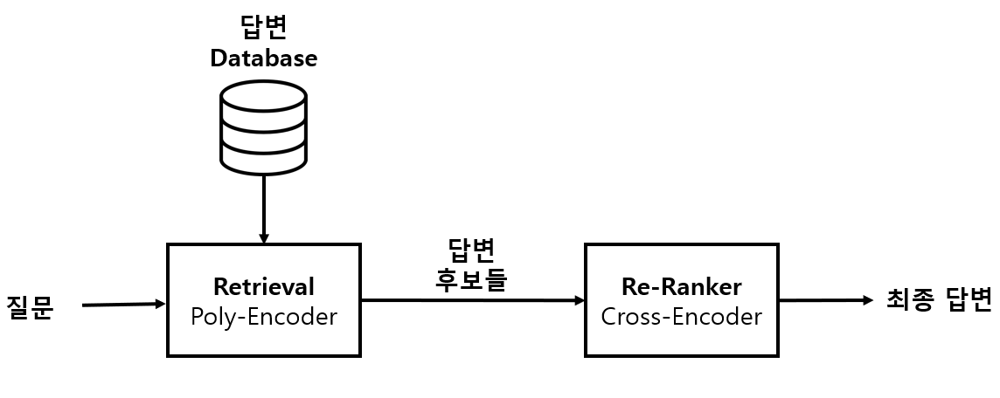
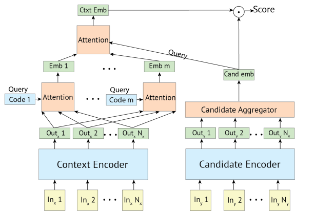
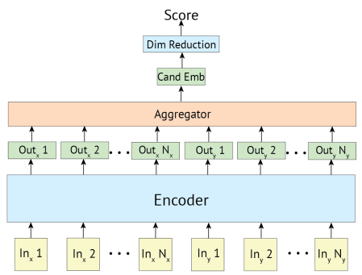

### :book: Contents Table
- [프로젝트 내용](#프로젝트-내용)
   &rarr; [챗봇 구성도](#챗봇-구성도)
   &rarr; [챗봇 시스템](#retrieval-based)
   &rarr; [Poly Encoder](#poly-encoder)
   &rarr; [Cross Encoder](#cross-encoder)
   &rarr; [Problem Solving](#problem-solving)
- [Repo 설명](#repo-설명)
---
## 프로젝트 내용

### 챗봇 구성도

- input으로 질문이 들어오면, 1차적으로 답변 DB에서 Poly Encoder로 k개의 답변 후보 선정
- 2차로 Cross Encoder를 통해 최종 답변 선정

<br>

### Retrieval-Based
- 생성형 챗봇인 Chat GPT는 Hallucination현상 등으로 인해 정확하지 않은 답변을 도출하는 경우 있음
- 정확한 답변만을 해야하는 상담 챗봇 특성으로 인해 Retrieval System Chatbot을 선정
- 또한 생성형에 비해 답변 속도가 비교적 빠름
<br>

### Poly Encoder
 
- 답변의 후보들인 candidate text들의 embedding값들을 미리 계산하여 저장해두고 사용가능 하여 **빠른 inference time**
- Context Encoder의 아웃풋들간의 Attention을 통해 m개의 embedding을 생성
- 생성된 m개의 embedding과 사전에 저장된 cand embedding들간의 final attention mechanism을 추가하여 **좋은 답변 탐색 가능**

<br>

### Cross Encoder

- context token과 cadidate token을 concat하여 하나의 input으로 만들어 Encoder통하여 embedding생성 후 dim reduction 후 Score계산 
- 모든 context token과 candidate token간의 attention을 수행하므로 **매우 좋은 질문 답변 이해도**
- 모델 구조상 candidate text에 대하여 embedding을 미리 생성하지 못하므로 candidate가 많을수록 **inference time이 매우 길어짐**

:memo: [참조 논문](https://arxiv.org/abs/1905.01969) 및 [논문 리뷰](https://www.notion.so/Poly-encoders-architectures-and-pre-training-strategies-for-fast-and-accurate-multi-sentence-scorin-ba51708779cf492695c307512b7a4a9c?pvs=4)
모델 관련 더 자세한 내용은 위 링크 참조

<br>

### Problem-Solving

- 문제 
   - 3개의 주제를 하나의 챗봇으로 학습시켜서 유사한 단어(수도세 내는법, 지방세 내는법 등)가 많이 포함되어서 답변이 좋지 않게 나옴
   - 아예 엉뚱한 질문(점심으로 무엇을 먹을까요? 등)을 해도 답변들 중 가장 유사한 답변을 함 
   - 질문을 하는 방법에 따라 정확한 답변이 나오기도 하고 유사한 다른 답변이 나오기도 함
- 해결 
   - 애초에 채팅을 하기 전 어떤 주제(일반행정, 상하수, 코로나)에 관하여 질문할 것인지 정하게한 뒤 Retrieval을 해당 주제 답변들에 대해서만 수행
   - 점수(처음에는 Poly Score만을 사용하다가 &rarr; 사용자의 질문과 학습 질문간의 cosine similarity 적용 &rarr; Re-Ranker역할을 할 Cross Encoder새로 학습 시켜 Cross Score로 적용)가 일정 Threshold를 넘지 못하면 `질문을 이해하지 못했습니다. 다시 질문해주세요.`라고 출력
   - 앞서 말했듯이 Poly Score가 가장 높은 답변보다 질문을 이애하는 능력이 더 좋은 Cross Encoder로 구한 Cross Score가 더 정확함 &rarr; Poly Encoder로 약 800여개의 답변들중 상위 k(hyper parameter)개의 답변 후보를 구하고 이들에 대해 Cross Encoder수행 &rarr; 정확도와 infrence time간의 적절한 조화

---
## Repo 설명

### Repo Structure
```shell
├─datasets
├─examples
├─models
│  ├─bert
│  ├─cross_encoder
│  └─poly_encoder
├─png
├─src
└─utils
```


<br>

### 학습 위한 Bert Model Setup

- BERT 관련 다른 원하는 모델있으면 사용가능
1. [BERT model] 
   - huggingface ['kykim/bertshared-kor-base'](https://huggingface.co/kykim/bertshared-kor-base/tree/main) 에서 pytorch_model.bin 다운로드 후 models/bert에 저장

2. [RoBERTa model] 
   - huggingface ['klue/roberta-large'](https://huggingface.co/klue/roberta-large/tree/main) 에서 pytorch_model.bin 다운로드 후 models/roberta에 저장

<br>

### 데이터셋
1. 원본 데이터 : [AIhub 민원(콜센터) 질의-응답 데이터](https://aihub.or.kr/aihubdata/data/view.do?currMenu=115&topMenu=100&aihubDataSe=realm&dataSetSn=98) 라벨링 데이터 중 다산콜센터 데이터 (json) 사용

2. 다산콜센터 상담 데이터 중 일반행정, 상하수도, 코로나 관련 주제 데이터 사용

3. 각 주제별로 상담에 유용하다고 생각되는 [질문 -답]쌍 250개 이상 추출, 생성

4. 데이터 학습을 위한 데이터 형식 예시

|       **index**       |   **q1**  |   **q2**  |  **q3**   |  **q4**  |  **response**   |
| :---------------: | :--------: | :--------: | :--------: | :--------: | :--------: |
|   0    |   코로나 자가격리시 일을 못하는데 어떻게 하나요?    |   자가격리시 일을 못하는데 어떻게 하나요?    |   자가격리로 일을 못하는데 방법이 있나요 ?    |   코로나 자가격리때문에 일을 못하는데 어떻게 하나요?     |   정부에서 별도 지원금을 지급하고 있습니다    |
| 1  |  코로나 자가격리 지원금을 위한 필요서류가 있나요?    |   코로나 자가격리 지원금을 위해 준비해야할 필요서류가 있나요?    |   코로나 자가격리 지원금 신청할때 준비할 필요서류가 있나요?    |   코로나 자가격리 지원금 신청할때 서류가 있나요?     |   신청서와 신분증 사분, 자가격리이행 확약서 등입니다.    |

- 챗봇에서 사람들마다 질문하는 방식이 다를 수 있음
   - 하나의 답변에 대해 의미는 같으나 다양한 문장 구조를 가진 질문을 총 4개의 질문을 구성
   - 경우에 따라서 질문의 개수는 다르게 해도 상관없음
- pd.DataFrame을 pickle 확장자 파일형태로 저장

<br>

### 학습 코드 예시
1. Train **Poly-Encoder**
   ```shell
   python utils/run.py \
   --model_type bert \
   --bert_model models/bert/ \
   --output_dir result/train1 \
   --train_dir datasets/ \
   --train_file dasan_train_data.pickle \
   --valid_file dasan_train_data.pickle \
   --use_pretrain \
   --architecture poly \
   --poly_m 16 \
   --train_batch_size 2 \
   --eval_batch_size 2 \
   --max_contexts_length 256 \
   --max_response_length 64 \
   --num_train_epochs 1000
   ```
2. Train **Cross-Encoder**
   ```shell
   python utils/run.py \
   --model_type bert \
   --bert_model models/bert/ \
   --output_dir result/train2 \
   --train_dir datasets/ \
   --train_file dasan_train_data.pickle \
   --valid_file dasan_train_data.pickle \
   --use_pretrain \
   --architecture cross \
   --train_batch_size 2 \
   --eval_batch_size 2 \
   --max_contexts_length 256 \
   --max_response_length 64 \
   --num_train_epochs 1000
   ```

<br>

### Inference

<!-- ####  -->

1. 답변 후보 text들의 embedding을 미리 계산하기 위하여 text2emb.py 실행
   ```shell
   python utils/text_2_emb.py \
   --model_type bert \
   --bert_model models/bert \
   --text_path /path/to/카테고리별답변들.txt \
   --output_dir /path/to/카테고리별embedding.pickle \
   --gpu 1
   ```
   - 카테고리별답변들.txt 파일은 한 줄마다 학습시킨 답변들 하나씩 작성
   - output인 카테고리별embedding.pickle의 예시는 우리 datasets/{category}_with_text.pickle 를 통해서 확인 가능
2. 이후 [inference.py](utils/inference.py)를 통하여 모델 생성하여 챗봇 모델 생성하여 [질문->답변] 실험 가능
   - 자세한 실행 코드는 examples 폴더의 how_2_inference.ipynb 파일 참조


<br>


### 학습환경

|       모델       |       환경       |   **CPU**  |   **RAM**  |  **GPU**   |  **OS**  |  **Training Time**   |
| :---------------: | :---------------: | :--------: | :--------: | :--------: | :--------: | :--------: |
|    Poly Encoder    |    AWS    |   AMD-EPYC   |   16G    |   A10(24G)    |   Ubuntu     |   24hr    |
|    Cross Encoder    |    Colab pro+    |   Intel-xeon   |   80G    |   A100(40G)    |   Ubuntu     |   21hr    |

<br>

### Requirements

- requirements.txt 참조
