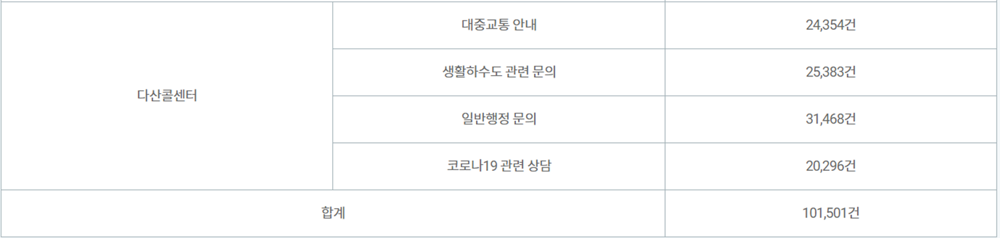

## TTS (JETS fine-tuning)

한국어 다산 상담을위한 TTS 모델을 만들기 위한 프로젝트입니다. 본 레포지토리는 ESPNet의 tts recipe 형식을 따르고 있습니다. 


#### 데이터셋

- AIhub의 상담 질의응답 데이터 대본 중 총 410개의 문장을 [황민규](https://github.com/suted2)님이 직접 녹음해서 총 40분 분량의 데이터를 준비했습니다.

org 폴더안에 학습시킬 음성파일들과 transcripts.txt를 저장하고 zip파일로 만들었습니다.

```shell
org
├── 00000.wav
├── 00001.wav
├── 00002.wav
...
├── 00400.wav
├── 00401.wav
└── transcripts.txt
```

위의 폴더에서 `org/transcripts.txt`는 다음과 같은 형식을 취하고 있습니다.
```
00000.wav|상담내용1
00001.wav|상담내용2
...
```

#### 학습
그리고 코랩환경 [](https://colab.research.google.com/drive/1sao-LS0dLj3jNt7CBF_qCm6X2yO6Cg5I?usp=sharing)에서 학습시키고 TTS학습과정과 inference성능을 테스트하였습니다.

### Appreciation
- 본 TTS프로젝트는 seastar105님의 [kr-custon-tts](https://github.com/seastar105/kr-custom-tts)레포지토리를 이용하여 진행하였습니다.

